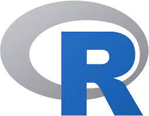

If you are referring to the use of R language for data analysis and visualization in a more interactive or engaging manner, there are several packages and tools available that can enhance the visual and interactive aspects of data analysis in R. These packages can provide a more user-friendly and visually appealing experience when exploring and presenting data.

But maybe you dont know about it, my suggestion download it now, and dont give up, trust me this language broken the wall for a great space in your mind!
-please let me try help you to open it!

What is R Language?
R is a programming language and environment commonly used for data analysis, statistical computing, and graphical visualization. It was created by Ross Ihaka and Robert Gentleman at the University of Auckland, New Zealand, in the early 1990s.
Statistical analysis: R provides extensive built-in statistical functions and libraries for conducting descriptive statistics, hypothesis testing, regression analysis, time series analysis, clustering, classification, and more. These capabilities make it an ideal tool for scientific research and data-driven decision-making.

Overall, R is a versatile and widely used language in data analysis, statistics, and research. Its open-source nature, extensive libraries, and active community make it a powerful tool for manipulating, analyzing, and visualizing data.

For more information please visit this Site:
https://cran.r-project.org/

What is RStudio?
In summary, RStudio is an integrated development environment (IDE) specifically designed for the R programming language. It provides a user-friendly interface that enhances the coding experience and supports efficient data analysis, visualization, and statistical modeling.

For more information please visit this Site:
https://posit.co/download/rstudio-desktop/

## R-Script 001 - Install rStudio.
Access the Rstudio site (Where have both of Distribution) R and RStudio

<imagem oo1>
where you can immerse yourself in the joy of R programming so that your coding journey becomes an adventure full of fun and creativity.
After all installed we will start to first step.

## Google Drive - If you dont have google drive.
In this project we will use the google driive to save a project and the Data Source for SAC model.
if you dont have account please see the support document. 3-GoogleDrive.md

## R-Script 002 - Open rStudio.
in this IDE , now its possible to make a first steps.
My recomendation are open the file source, what save in ProjectR folder. [GetStockHist.r]

## R-Script 003 - What it is package.
Imagine you're planning a trip to a new city called Rville, and you want to make the most out of your adventure in the R language. Well, think of R packages as the attractions, activities, and tools that make your journey in Rville exciting and fun!

Each R package is like a unique destination within Rville, offering you specific features, functions, and capabilities. Just like choosing attractions for your trip, you can select and install different R packages based on your needs and interests.

For example, if you want to explore data visualization, you might visit the ggplot2 , trust me this package works in SAC code, but this subject it other moment we talk about.
package, known for its beautiful and customizable plots. If you're into statistical analysis, you could head to the stats package, offering various statistical functions. And if you're venturing into machine learning, you might want to stop by the caret or tensorflow packages.

Just like tourists sharing their experiences, R programmers and users recommend their favorite packages. You can find these packages in the official "Rville Tourist Guide," also known as the Comprehensive R Archive Network (CRAN), or in other popular package repositories like GitHub.

Remember, in Rville, there's an endless variety of packages waiting for you to discover. So grab your backpack, browse the extensive package collection, and embark on an exciting journey to enhance your R language experience!

### R-Script 003.1 - quantmod.
https://github.com/joshuaulrich/quantmod
In the R language, quantmod is a widely-used package that provides a set of functions and tools for quantitative financial modeling and trading analysis. It primarily focuses on the retrieval, analysis, and visualization of financial data.
### R-Script 003.2 - xts.
https://cran.r-project.org/web/packages/xts/index.html
With the xts package, you can perform various operations on time series data, including subsetting, merging, aggregating, and applying mathematical functions. It also supports a wide range of time-based indexing and allows for straightforward handling of irregularly-spaced and regularly-spaced time series.

### R-Script 003.3 - readr.
https://cran.r-project.org/web/packages/readr/index.html
In summary, the readr package is a useful tool for efficiently reading structured data from files into R, providing a convenient and versatile way to import data for further analysis and manipulation.

## R-Script 004 - Hands on RScript.
Open rStudio. Image Rsctudio.

Open the File in your space. 
Note - you need two files like this image bellow.
<image R_Script003>

Now open GetStockHist.r
Change you need to do:
Line 17 and Line 78 - Write the directory where your code need to save and run.
  My sample: 
    StockProjFolder <- "C:/Users/RZang/Meu Drive/ForecastRscriptAndSAC/ProjectR/"

Line 68 - Write the directory where your code need to save the resultset.
  My sample: 
    StockProjFolder <- "C:/Users/RZang/Meu Drive/ForecastRscriptAndSAC/File_Source/"

>[!example]- Note001.
>in line 11 - comented the comand to install the package if is necessary.
>#install.packages("quantmod")

To run , just click in the button Run or Ctrl+Shift+Enter.
Congratulation , now you have the data source to go to next step. Google Drive>
<image R_Script004>

