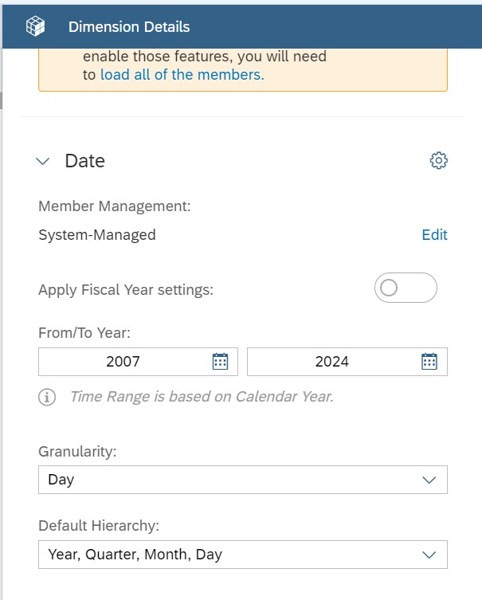

Now you start to make your job in SAP Analitic Cloud.

 

  

In this document we will create a model in SAC. 
To this we need go SAC.

## SAC Modeling 001 - Points we need to know
This model we wil create to get each objects as necessary in this material. 
Below have a simple diagram what you need to know.
```mermaid
flowchart LR
B(Date Dim) === C{Fact Table}
D(Symbol Dim) === C{Fact Table}
E(Company Dim) === C{Fact Table}
C{Fact Table} -.Stock Values.-> A[Measures]
A[Measures] === Z[Calculations]

```
## SAC Modeling 002 - Create a new model:
A - In SAC Tenant, click in Modeler into trhee dot.  

  
  

B - Create New.  

  
  
 

  
  

 
C - New Model (Recomendation)  

  
  

## SAC Modeling 003 - Configurate model:
Now you need to do it the model.  
D - add the measure.

  
   
 

  

 

  

### SAC Configurate model Create Measures
E - OPEN. 
The open price is the first price a stock trades at during the day. For active stocks that price will likely be set right at the market open, which occurs at 9:30am Eastern Standard Time.
 

  

-------
F - High. 
The high represents a stock's highest trading price for the day. 
 

  

G - LOW. 
The low is a stock's lowest trading price for the day. 52-week high and low. The 52-week high and low are a stock's highest and lowest 
 

  

H - Close. 
the closing price after adjustments for all applicable splits and dividend distributions. 

  

I - VOLUME. 
is the number of shares of a security traded during a given period of time. 

  

I - Adjusted. 
is the closing price after adjustments for all applicable splits and dividend distributions. Data is adjusted using appropriate split and dividend multipliers, adhering to Center for Research in Security Prices (CRSP) standards. 

  

### SAC Configurate Calendar Dimension
J - Date Dimension. 
Now we talk about The time! 

  
 
Click in Date! 
 

K - Date Dimension Detail.
The Dimension Date at a granularity of Day is a crucial aspect when analyzing and working with historical data since 2007. Here are some key reasons for its importance:

Time-based analysis: With a Dimension Date at Day granularity, you can perform detailed time-based analysis. This allows you to identify trends, seasonal patterns, and anomalies within the data on a daily basis. Granularity at the day level enables a comprehensive understanding of how variables evolve and interact over time.

Historical context: By starting the Dimension Date from 2007, you have a substantial historical timeframe. This long-term historical perspective is valuable for evaluating how variables, such as stock prices, have changed and evolved over the years. It provides context for generating insights based on long-term trends and patterns.

Comparative analysis: The Dimension Date allows you to compare and contrast data across different time periods. You can analyze performance metrics, such as daily returns or trading volumes, over specific time ranges and make comparisons to identify patterns, changes, or anomalies. This comparative analysis helps in understanding how metrics have shifted over time.

Forecasting and predictive modeling: Historical data with a Dimension Date at a day granularity is ideal for developing forecasting models and predictive analytics. By leveraging the rich historical dataset, you can build accurate and robust models that capture the dynamics and variability of underlying variables over time. These models can help anticipate future trends and make informed decisions.

Data-driven decision making: With detailed historical data and a Day granularity, you can make data-driven decisions with greater confidence. By analyzing patterns and trends, you can identify correlations, causations, and potential factors influencing the data. This information can guide important business decisions, investment strategies, or risk assessments based on solid historical evidence.

In summary, the Dimension Date at a granularity of Day, covering historical data from 2007, provides a comprehensive and rich context for extensive time-based analysis. It enables a deep understanding of historical trends, supports comparative analysis, facilitates forecasting and predictive modeling, and drives data-driven decision making. Utilizing this invaluable historical data can help uncover insights and drive actionable outcomes.  
  
  

  

