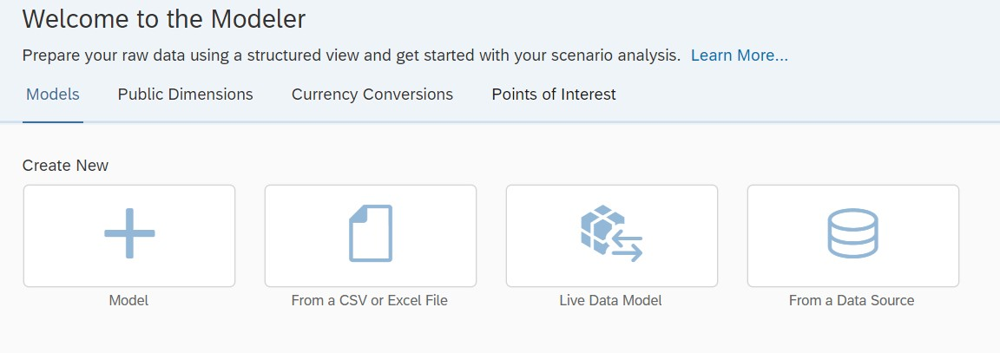
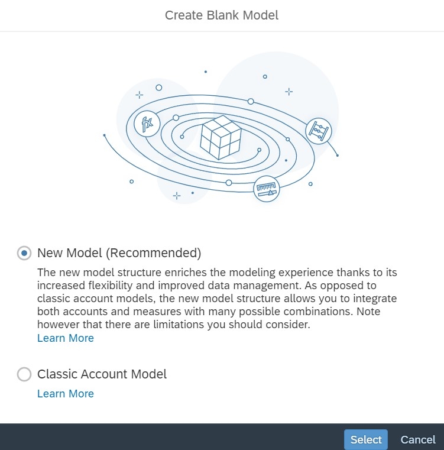
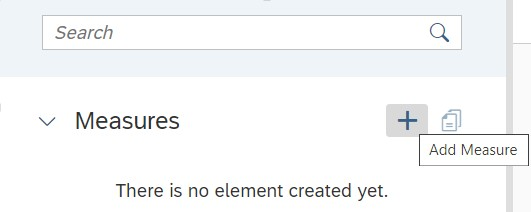
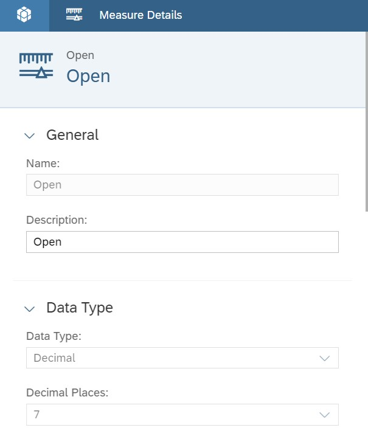
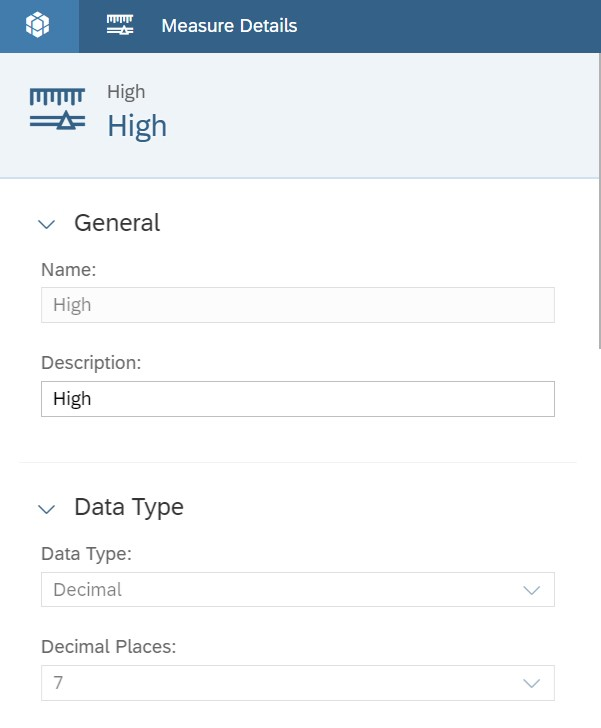
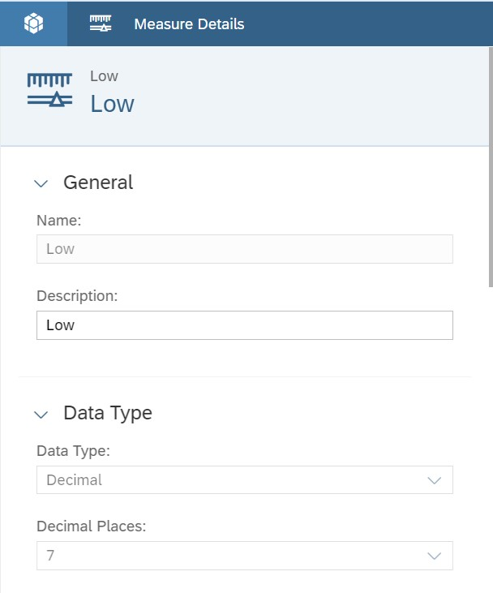
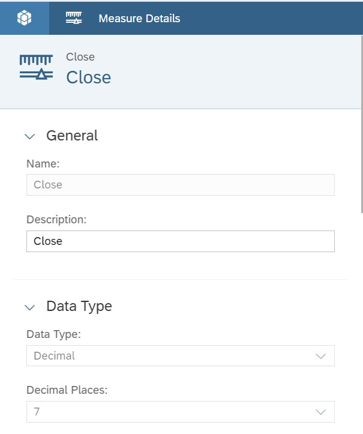
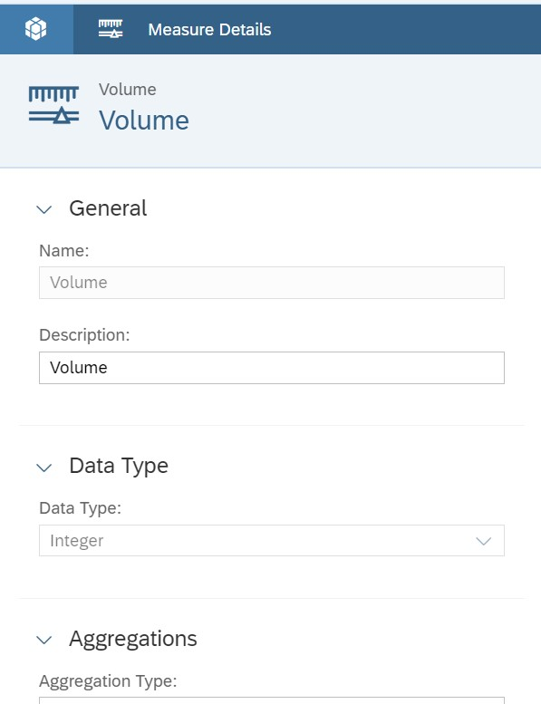

Now you start to make your job in SAP Analitic Cloud.

 

  

In this document we will create a model in SAC. 
To this we need go SAC.

## SAC Modeling 001 - Points we need to know
This model we wil create to get each objects as necessary in this material. 
Below have a simple diagram what you need to know.
```mermaid
flowchart LR
B(Date Dim) === C{Fact Table}
D(Symbol Dim) === C{Fact Table}
E(Company Dim) === C{Fact Table}
C{Fact Table} -.Stock Values.-> A[Measures]
A[Measures] === Z[Calculations]

```
## SAC Modeling 002 - Create a new model:
A - In SAC Tenant, click in Modeler into trhee dot.  

  
  

B - Create New.  

  
  

 
 

  
  

 
C - New Model (Recomendation)  
 

## SAC Modeling 003 - Configurate model:
Now you need to do it the model.  
D - add the measure.
 

### SAC Configurate model Create Measures
E - OPEN.
 

F - High.
 

G - LOW.
 

H - Close.
 

I - VOLUME.
 

I - Adjusted.
 

I - Adjusted.
 

### SAC Configurate Calendar Dimension
J - Date Dimension.
 

K - Date Dimension Detail.
  
  

  

